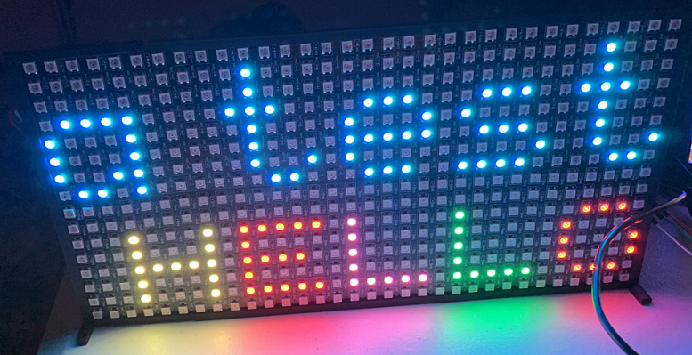

rpilights
==========

Software for LED window display such as the one in [this video](https://www.youtube.com/watch?v=n9-j6oeJJw4).

### Hardware

Lights [here](https://www.amazon.com/dp/B00QK8QE1A).  This link may be outdated at some point as the vendor likes to play
Feng Shui with his listings.

Either mount in pegboard (holes every 2 inches drilled out to 12mm) or in 1/2 inch grid hardware cloth.

You will an external 5v power supply to power the lights if there are more than 100 or so.
I use [this one](https://www.amazon.com/dp/B00EZJFMKU).
The +5v and GND will need to be
connected to the power wires around every 200 lights due to internal resistance of the wires and circuitry.  Otherwise you will
see the intensity of the lights dim noticeably at the far end.

Also, unless you boost the Pi's 3v signal to 5v, make sure the signal wire is very short, a half foot or a foot at most.
Otherwise the lights will flash randomly.

See the "Limitations" info in the README for the rpi\_ws281x submodule -- on some Pis, the sound submodule keeps the lights from
working and needs to be disabled.

### Software

Put all the files into the directory /home/pi/rpilights

The command "make" should build the "rpilights" command, but it won't work properly until you configure the map.txt file
to reflect the physical layout of your LED display.

### map.txt file

The "map.txt" file describes the physical layout of your LED lights as an ASCII picture, viewed from the back of the display.
The existing map.txt file is for a complicated two-channel multi-panel display that I have in my four basement windows right
now.  Please edit it to reflect the arrangement of your lights:

	o			LED lights
	| and --		wires
	0 and 1		The first LED light on channels 0 (pin 18) and 1 (pin 19)
	.		(dot) Unused light position (gaps between windows)

For example, a simple 10x10 LED panel might look like this:

	o--o  o--o  o--o  o--o  o--o
	|  |  |  |  |  |  |  |  |  |
	o  o  o  o  o  o  o  o  o  o
	|  |  |  |  |  |  |  |  |  |
	o  o  o  o  o  o  o  o  o  o
	|  |  |  |  |  |  |  |  |  |
	o  o  o  o  o  o  o  o  o  o
	|  |  |  |  |  |  |  |  |  |
	o  o  o  o  o  o  o  o  o  o
	|  |  |  |  |  |  |  |  |  |
	o  o  o  o  o  o  o  o  o  o
	|  |  |  |  |  |  |  |  |  |
	o  o  o  o  o  o  o  o  o  o
	|  |  |  |  |  |  |  |  |  |
	o  o  o  o  o  o  o  o  o  o
	|  |  |  |  |  |  |  |  |  |
	o  o  o  o  o  o  o  o  o  o
	|  |  |  |  |  |  |  |  |  |
	0  o--o  o--o  o--o  o--o  o

The format of the map.txt file is very fussy; it can't have comments in it, blank lines at the beginning, the spacing has to be exactly like
the examples, etc.

### rpilights command

The "rpilights" command by itself with no further arguments should give a list of possible commands:

	rpilights on		Display scrolling time, date, weather
	rpilights off		Turn lights off
	rpilights red		Set all lights to red
	rpilights blue		Set all lights to blue
	rpilights green		Set all lights to green
	rpilights magenta	Set all lights to magenta
	rpilights yellow	Set all lights to yellow
	rpilights cyan		Set all lights to cyan
	rpilights rainbow	Display scrolling rainbow pattern
	rpilights ip		Display scrolling IP address
	rpilights pacman	Display Pacman animation

### rc.local

The file misc/rc.local has suggested commands to add to your existing /etc/rc.local file.

### updatewx script

Edit the file scripts/updatewx to put your zipcode in place of mine (55337).
This script gets weather info (forecast, temperature and humidity) every five minutes.
You'll want to start this script from rc.local.  If you don't run this, the 'lights on' command won't work.
